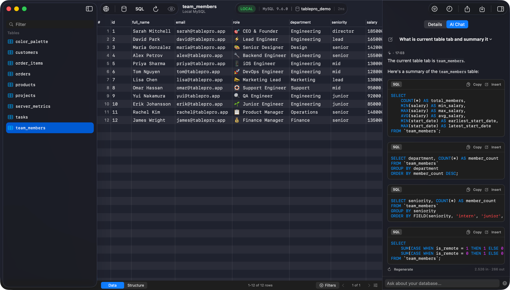

<p align="center">
  
</p>

<h1 align="center">TablePro</h1>

<p align="center">
  一款快速、原生的 macOS 数据库客户端，内置 AI 助手。
</p>

<p align="center">
  <a href="https://docs.tablepro.app">文档</a> · <a href="https://github.com/TableProApp/TablePro/releases">下载</a> · <a href="https://github.com/TableProApp/TablePro/issues">报告 Bug</a>
</p>

<p align="center">
  <a href="https://www.gnu.org/licenses/agpl-3.0"></a>
</p>

<p align="center">
  <a href="README.vi.md">Tiếng Việt</a>
  <a href="README.md">English</a>
</p>

---

<p align="center">
  
</p>

## 关于

TablePro 是一款原生 macOS 数据库客户端。支持连接 MySQL、MariaDB、PostgreSQL、SQLite、MongoDB、Redis、SQL Server 和 Redshift。包含支持自动补全、行内编辑和 AI 辅助的 SQL 编辑器。

## 安装

```bash
brew install --cask tablepro
```

或者从 [GitHub Releases](https://github.com/TableProApp/TablePro/releases) 下载 DMG 文件。

## 文档

完整文档请访问 [docs.tablepro.app](https://docs.tablepro.app)。

## 支持开发

TablePro 是免费开源的。如果您觉得它有用，请考虑[购买许可证](https://tablepro.app)以支持持续开发，并获得高级功能访问权限。

## 赞助商

感谢这些优秀的人对 TablePro 的支持：

**[Dwarves Foundation](https://dwarves.foundation/?ref=tablepro)** · **[Nimbus](https://getnimbus.io?ref=tablepro)** · **[Visnalize](https://visnalize.com?ref=tablepro)** · **[Huy TQ](https://github.com/imhuytq)** · **[Unikorn](https://unikorn.vn?ref=tablepro)**

## Star History

<a href="https://www.star-history.com/?repos=TableProApp%2FTablePro&type=date&legend=top-left">
 <picture>
   <source media="(prefers-color-scheme: dark)" srcset="https://api.star-history.com/image?repos=TableProApp/TablePro&type=date&theme=dark&legend=top-left" />
   <source media="(prefers-color-scheme: light)" srcset="https://api.star-history.com/image?repos=TableProApp/TablePro&type=date&legend=top-left" />
   
 </picture>
</a>

## 许可证

本项目基于 [GNU Affero General Public License v3.0 (AGPLv3)](LICENSE) 许可证授权。贡献代码需要签署贡献者许可协议 (CLA)。详情请参阅 [CLA.md](CLA.md)。
